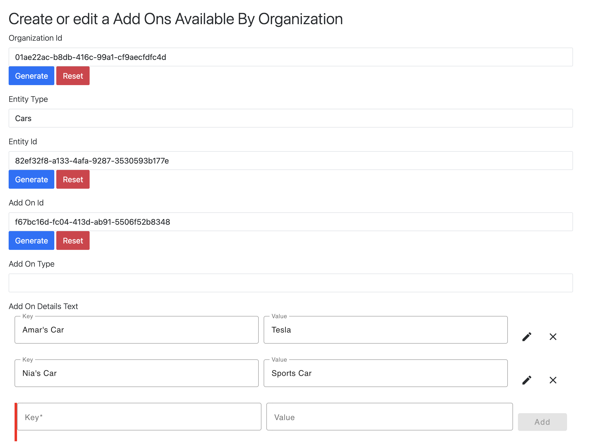
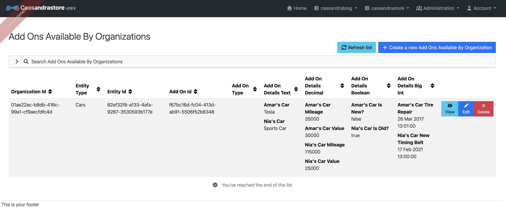

.
## JHipster Example for Composite Primary Keys in Cassandra

### About this JHipster Example

This code was generated using the JHipster blueprint `generator-jhipster-cassandra`.
The source code for the underlying JHipster blueprint is available at: https://github.com/amarpatel-xx/generator-jhipster-cassandra.

The blueprint for generating the composite primary key with Cassandra entities is open source software made with love by `Amar Premsaran Patel`.

This code in this example has a JDL which shows 2 Cassandra entities that have composite primary keys and 3 Cassandra entities that have single-value primary keys. There are also other entities which show composite primary keys using various combinations of partition keys and clustering keys.  The example entities in the JDL is based on

Matt Raible's frequently used the blog and store examples in his capability demonstrations.

The current blueprint now supports a multiple fields of type PrimaryKeyType.PARTITIONED; a field which is the partition column is specified as such with the `@customAnnotation("PrimaryKeyType.PARTITIONED")` custom annotation. If a entity needs to specify additional fields with type `PrimaryKeyType.CLUSTERED`, they are specified using `@customAnnotation("PrimaryKeyType.CLUSTERED")`. The greater than, less than and equal to query methods are autogenerated for the clustering columns. There are no relationships between Cassandra entities, as such relationships cannot be specified. The blueprint also support the Cassandra type `CassandraType.Name.SET` and `CassandraType.Name.MAP`; see below for examples.

Below are various examples of defining JDL entities using the @customAnnotation methodology to specify the details of the Cassandra composite primary key. Also, below is an example of a single-value primary key entity. Some example entities are of composite primary keys using Map fields and some are using a Set field. There are also examples of single-value primary key entities using Maps and Set data structures.
```
    // Composite Primary Key Example:
    entity Post {
      @Id @customAnnotation("PrimaryKeyType.PARTITIONED") @customAnnotation("CassandraType.Name.BIGINT") @customAnnotation("UTC_DATE") @customAnnotation("0") createdDate Long 
      // Do not name composite primary key fields as 'id' as it conflicts with the 'id' field in the JHipster entity.
      @customAnnotation("PrimaryKeyType.CLUSTERED") @customAnnotation("CassandraType.Name.BIGINT") @customAnnotation("UTC_DATETIME") @customAnnotation("1") addedDateTime Long
      @customAnnotation("PrimaryKeyType.CLUSTERED") @customAnnotation("CassandraType.Name.UUID") @customAnnotation("") @customAnnotation("2") postId UUID
      @customAnnotation("") @customAnnotation("CassandraType.Name.TEXT") @customAnnotation("") @customAnnotation("") title String required
      @customAnnotation("") @customAnnotation("CassandraType.Name.TEXT") @customAnnotation("") @customAnnotation("") content String required
      @customAnnotation("") @customAnnotation("CassandraType.Name.BIGINT") @customAnnotation("UTC_DATETIME") @customAnnotation("") publishedDateTime Long
      @customAnnotation("") @customAnnotation("CassandraType.Name.BIGINT") @customAnnotation("UTC_DATE") @customAnnotation("") sentDate Long
    }

    // Single-value Primary Key Example:
    entity Product {
      // Primary Key field can be named 'id'.  JHipster natively supports single-value primary keys.  This blueprint also supports single-value primary keys.
      @Id @customAnnotation("PrimaryKeyType.PARTITIONED") @customAnnotation("CassandraType.Name.UUID") @customAnnotation("") @customAnnotation("") id UUID
      @customAnnotation("") @customAnnotation("CassandraType.Name.TEXT") @customAnnotation("") @customAnnotation("") title String required
      @customAnnotation("") @customAnnotation("CassandraType.Name.DECIMAL") @customAnnotation("") @customAnnotation("") price BigDecimal required min(0)
      @customAnnotation("") @customAnnotation("CassandraType.Name.BLOB") @customAnnotation("image") @customAnnotation("") image ImageBlob
      @customAnnotation("") @customAnnotation("CassandraType.Name.BIGINT") @customAnnotation("UTC_DATE") @customAnnotation("") addedDate Long required
    }

    // Composite Primary Key Example with TIMEUUID clustered key, multiple partitioned keys, with multiple clustered keys.
    entity SaathratriEntity2 {
      @Id @customAnnotation("PrimaryKeyType.PARTITIONED") @customAnnotation("CassandraType.Name.UUID") @customAnnotation("") entityTypeId UUID
      @customAnnotation("PrimaryKeyType.PARTITIONED") @customAnnotation("CassandraType.Name.BIGINT") @customAnnotation("") yearOfDateAdded Long
      @customAnnotation("PrimaryKeyType.CLUSTERED") @customAnnotation("CassandraType.Name.BIGINT") @customAnnotation("UTC_DATE") arrivalDate Long
      @customAnnotation("PrimaryKeyType.CLUSTERED") @customAnnotation("CassandraType.Name.TIMEUUID") @customAnnotation("TIMEUUID") blogId UUID
      @customAnnotation("") @customAnnotation("CassandraType.Name.TEXT") @customAnnotation("") entityName String
      @customAnnotation("") @customAnnotation("CassandraType.Name.TEXT") @customAnnotation("") entityDescription String
      @customAnnotation("") @customAnnotation("CassandraType.Name.DECIMAL") @customAnnotation("") entityCost BigDecimal
      @customAnnotation("") @customAnnotation("CassandraType.Name.BIGINT") @customAnnotation("UTC_DATE") departureDate Long
    }

    // Example showing a text/string set.
    entity SaathratriEntity3 {
      @Id @customAnnotation("PrimaryKeyType.PARTITIONED") @customAnnotation("CassandraType.Name.TEXT") @customAnnotation("") entityType String
      @customAnnotation("PrimaryKeyType.CLUSTERED") @customAnnotation("CassandraType.Name.TIMEUUID") @customAnnotation("") createdTimeId UUID
      @customAnnotation("") @customAnnotation("CassandraType.Name.TEXT") @customAnnotation("") entityName String
      @customAnnotation("") @customAnnotation("CassandraType.Name.TEXT") @customAnnotation("") entityDescription String
      @customAnnotation("") @customAnnotation("CassandraType.Name.DECIMAL") @customAnnotation("") entityCost BigDecimal
      @customAnnotation("") @customAnnotation("CassandraType.Name.BIGINT") @customAnnotation("UTC_DATE") departureDate Long
      @customAnnotation("CassandraType.Name.SET") @customAnnotation("CassandraType.Name.TEXT") @customAnnotation("") tags String,
    }

    // Example showing key-value data structure.
    entity SaathratriEntity4 {
      @Id @customAnnotation("PrimaryKeyType.PARTITIONED") @customAnnotation("CassandraType.Name.UUID") @customAnnotation("") organizationId UUID
      @customAnnotation("PrimaryKeyType.CLUSTERED") @customAnnotation("CassandraType.Name.TEXT") @customAnnotation("") attributeKey String
      @customAnnotation("") @customAnnotation("CassandraType.Name.TEXT") @customAnnotation("") attributeValue String
    }

    // Example showing text/string, boolean, numeric and date-time maps.
    entity AddOnsAvailableByOrganization {
      @Id @customAnnotation("PrimaryKeyType.PARTITIONED") @customAnnotation("CassandraType.Name.UUID") @customAnnotation("") organizationId UUID
      @customAnnotation("PrimaryKeyType.PARTITIONED") @customAnnotation("CassandraType.Name.TEXT") @customAnnotation("") entityType String
      @customAnnotation("PrimaryKeyType.PARTITIONED") @customAnnotation("CassandraType.Name.UUID") @customAnnotation("") entityId UUID
      @customAnnotation("PrimaryKeyType.CLUSTERED") @customAnnotation("CassandraType.Name.UUID") @customAnnotation("") addOnId UUID
      @customAnnotation("") @customAnnotation("CassandraType.Name.TEXT") @customAnnotation("") addOnType String
      @customAnnotation("CassandraType.Name.MAP") @customAnnotation("CassandraType.Name.TEXT") @customAnnotation("") addOnDetailsText String
      @customAnnotation("CassandraType.Name.MAP") @customAnnotation("CassandraType.Name.DECIMAL") @customAnnotation("") addOnDetailsDecimal BigDecimal
      @customAnnotation("CassandraType.Name.MAP") @customAnnotation("CassandraType.Name.BOOLEAN") @customAnnotation("") addOnDetailsBoolean Boolean
      @customAnnotation("CassandraType.Name.MAP") @customAnnotation("CassandraType.Name.BIGINT") @customAnnotation("UTC_DATETIME") addOnDetailsBigInt Long
    }

    // Another example showing text/string, boolean, numeric and date-time maps.
    entity AddOnsSelectedByOrganization {
      @Id @customAnnotation("PrimaryKeyType.PARTITIONED") @customAnnotation("CassandraType.Name.UUID") @customAnnotation("") organizationId UUID
      @customAnnotation("PrimaryKeyType.CLUSTERED") @customAnnotation("CassandraType.Name.BIGINT") @customAnnotation("UTC_DATE") arrivalDate Long
      @customAnnotation("PrimaryKeyType.CLUSTERED") @customAnnotation("CassandraType.Name.TEXT") @customAnnotation("") accountNumber String
      @customAnnotation("PrimaryKeyType.CLUSTERED") @customAnnotation("CassandraType.Name.TIMEUUID") @customAnnotation("") createdTimeId UUID
      @customAnnotation("") @customAnnotation("CassandraType.Name.BIGINT") @customAnnotation("UTC_DATE") departureDate Long
      @customAnnotation("") @customAnnotation("CassandraType.Name.UUID") @customAnnotation("") customerId UUID
      @customAnnotation("") @customAnnotation("CassandraType.Name.TEXT") @customAnnotation("") customerFirstName String
      @customAnnotation("") @customAnnotation("CassandraType.Name.TEXT") @customAnnotation("") customerLastName String
      @customAnnotation("") @customAnnotation("CassandraType.Name.TEXT") @customAnnotation("") customerUpdatedEmail String
      @customAnnotation("") @customAnnotation("CassandraType.Name.TEXT") @customAnnotation("") customerUpdatedPhoneNumber String
      @customAnnotation("") @customAnnotation("CassandraType.Name.TEXT") @customAnnotation("") customerEstimatedArrivalTime String
      @customAnnotation("") @customAnnotation("CassandraType.Name.TEXT") @customAnnotation("") tinyUrlShortCode String
      @customAnnotation("CassandraType.Name.MAP") @customAnnotation("CassandraType.Name.TEXT") @customAnnotation("") addOnDetailsText String
      @customAnnotation("CassandraType.Name.MAP") @customAnnotation("CassandraType.Name.DECIMAL") @customAnnotation("") addOnDetailsDecimal BigDecimal
      @customAnnotation("CassandraType.Name.MAP") @customAnnotation("CassandraType.Name.BOOLEAN") @customAnnotation("") addOnDetailsBoolean Boolean
      @customAnnotation("CassandraType.Name.MAP") @customAnnotation("CassandraType.Name.BIGINT") @customAnnotation("UTC_DATETIME") addOnDetailsBigInt Long
    }

    // Single-value Primary Key with Maps
    entity LandingPageByOrganization {
      @Id @customAnnotation("PrimaryKeyType.PARTITIONED") @customAnnotation("CassandraType.Name.UUID") @customAnnotation("") organizationId UUID
      @customAnnotation("CassandraType.Name.MAP") @customAnnotation("CassandraType.Name.TEXT") @customAnnotation("") detailsText String
      @customAnnotation("CassandraType.Name.MAP") @customAnnotation("CassandraType.Name.DECIMAL") @customAnnotation("") detailsDecimal BigDecimal
      @customAnnotation("CassandraType.Name.MAP") @customAnnotation("CassandraType.Name.BOOLEAN") @customAnnotation("") detailsBoolean Boolean
      @customAnnotation("CassandraType.Name.MAP") @customAnnotation("CassandraType.Name.BIGINT") @customAnnotation("UTC_DATETIME") detailsBigInt Long
    }

    // Single-value Primary Key with Set
    entity SetEntityByOrganization {
      @Id @customAnnotation("PrimaryKeyType.PARTITIONED") @customAnnotation("CassandraType.Name.UUID") @customAnnotation("") organizationId UUID
      @customAnnotation("CassandraType.Name.SET") @customAnnotation("CassandraType.Name.TEXT") @customAnnotation("") tags String
    }
```

## MAP Data Type UI Components

The blueprint generates custom Angular UI components for each Cassandra MAP value type. The following screenshots demonstrate the `AddOnsAvailableByOrganization` entity, which uses all four supported MAP types.

### MAP&lt;TEXT, TEXT&gt; — String Key-Value Pairs

Edit string-to-string map entries with inline key and value fields. Each entry can be added, edited, or removed.



### MAP&lt;TEXT, DECIMAL&gt; — Numeric Values

Edit string-to-decimal map entries for numeric data such as mileage, cost, or quantity.


### MAP&lt;TEXT, BOOLEAN&gt; — Boolean Toggle Values

Edit string-to-boolean map entries using toggle switches for true/false values.


### MAP&lt;TEXT, BIGINT&gt; with UTC_DATETIME — Date-Time Values

Edit string-to-datetime map entries with a full date and time picker (date, hours, minutes, AM/PM).


### List Page — All MAP Types Displayed

The list page renders all MAP columns with their key-value pairs displayed inline.


### Detail Page — All MAP Types Displayed

The detail/view page renders all MAP fields with their key-value pairs.



---

## Improvements Since v1.0.13 (Current: v1.0.16)

The underlying `generator-jhipster-cassandra` blueprint has received significant improvements since the last open-source tagged release (v1.0.13). This example has been regenerated with `generator-jhipster@9.0.0` and `generator-jhipster-cassandra@1.0.16`.

### AI Semantic Search with Vector Embeddings (v1.0.15+)
- Added support for **Cassandra VECTOR type** fields using `@customAnnotation("VECTOR")` with configurable dimensions.
- Generates CQL schema with `VECTOR<FLOAT, N>` columns and **SAI (Storage Attached Index)** for similarity search.
- Repository methods use **ANN OF** (Approximate Nearest Neighbor) queries for vector similarity.
- Service layer auto-generates embeddings on save/update via a configurable `EmbeddingService`.
- REST endpoint `/api/<entity>/ai-search` with field selection support for semantic search.
- Angular **AI search bar** with checkboxes for selecting which fields to search.
- Integrated with **Spring AI 2.0.0-M3** and `EmbeddingConfiguration` for OpenAI-compatible embedding providers.
- **Graceful degradation** when an API key is not configured.
- Consistent vector display: list/detail pages show first 3 floats with 5 decimal places; update page shows full vector in a readonly textarea.

### AnyBlob Content Type Support (v1.0.15+)
- Added support for **AnyBlob** fields using `@customAnnotation("any")`, enabling file uploads of any content type (PDF, DOCX, etc.).
- Generates **PDF badge styling** on list, detail, and update pages for PDF files.
- Full file upload/download support with content type detection.

### MAP and SET Display Fixes (v1.0.15+)
- Fixed detail page rendering of **MAP** and **SET** fields by converting legacy `*ngIf`/`*ngFor` directives to modern `@if`/`@for` control flow.
- Fixed `KeyValuePipe` import for standalone Angular components with MAP fields.
- All four MAP value types (TEXT, DECIMAL, BOOLEAN, BIGINT/UTC_DATETIME) render correctly on list, detail, and update pages.

### Cassandra Pagination Overhaul (v1.0.14)
- Replaced page-number-based pagination with native **Cassandra Slice pagination** using paging state tokens, which is the correct approach for Cassandra's distributed architecture.
- Added a dedicated `/slice` endpoint for backward-compatible paginated queries.
- Replaced automatic infinite scroll with a **Load More button** for better UX control.
- Fixed paging state extraction to use `CassandraPageRequest` with the correct public API.
- Fixed infinite "Load More" loop by properly checking for empty results.

### Composite Key Search Widget (v1.0.14)
- Added **findBy search methods** for Cassandra composite keys with a full search widget on entity list pages.
- Added **date pickers and comparison operators** (equals, greater than, less than, etc.) for clustering key fields.
- Clustering key fields are **automatically disabled** when an inequality operator is selected on a preceding clustering column (respecting Cassandra's query restrictions).
- Navbar entities are now **sorted alphabetically** for easier navigation.

### UTC Date Handling (v1.0.14)
- Added `UTC_DATE` display support that prevents timezone shifting -- dates are rendered exactly as stored.
- Added a custom `FormatUtcDatePipe` for consistent date-only formatting in Angular templates.
- Fixed UTC_DATE form handling to use dayjs throughout the stack (create, update, and search forms).
- Configured `DayjsDateAdapter` for Material Datepicker integration.

### Composite Key Sorting (v1.0.14)
- Added **column sorting** for Cassandra entities, with proper data array clearing when sort changes.
- Sort by composite key fields is now fully supported in the Angular list view.

### Backend Fixes (v1.0.14+)
- Fixed malformed CQL `@Query` generation in `findLatestBy` repository methods.
- Removed expensive `count()` queries from Cassandra resource templates (not supported efficiently by Cassandra).
- Fixed Cassandra pagination to use an explicit `pagingState` query parameter for clean API design.
- Improved translation key generation for Cassandra entities using i18n entity labels.
- Updated JHipster version reference from 8.6.0 to 9.0.0.

## Prerequisites:

- [Java](https://sdkman.io/) 21+
- [Node.js](https://nodejs.org/) 20+
- [Docker Desktop](https://www.docker.com/products/docker-desktop/)
- [JHipster](https://www.jhipster.tech/installation/) 9.0.0
- [generator-jhipster-cassandra](https://www.npmjs.com/package/generator-jhipster-cassandra) 1.0.16

### Build

Build Java Microservices using the Cassandra Composite Primary Key Blueprint

### Build Java Microservices using the Cassandra Composite Primary Key Blueprint

1. To generate a microservices architecture with Cassandra composite primary key support, run the following command:

**Linux / macOS:**
```console
npm install -g generator-jhipster-cassandra

git clone https://github.com/amarpatel-xx/jhipster-cassandra-example.git

cd jhipster-cassandra-example

sh saathratri-generate-code-dev-cassandra.sh
```

**Windows:**
```console
npm install -g generator-jhipster-cassandra

git clone https://github.com/amarpatel-xx/jhipster-cassandra-example.git

cd jhipster-cassandra-example

.\saathratri-generate-code-dev-cassandra.bat
```

 2. You should see the message:
```console
Congratulations, JHipster execution is complete!
```

### Run your Cassandra Composite Primary Key Entities Example

1.  When the process is complete, cd into the `gateway` directory and start Keycloak and Eureka using Docker Compose.

**Linux / macOS:**
```console
cd cassandragateway
docker compose -f src/main/docker/keycloak.yml up -d
docker compose -f src/main/docker/jhipster-registry.yml up -d
```

**Windows:**
```console
cd cassandragateway
docker compose -f src\main\docker\keycloak.yml up -d
docker compose -f src\main\docker\jhipster-registry.yml up -d
```
Please make sure the jhipster-registry-1 Docker Container is started; sometimes that container does not run after the above command and needs to be started manually in Docker Desktop.  The jhipster-registry-1 container should appear under the gateway application within Docker Desktop.

2.  Start `cassandragateway` database with Docker by opening a terminal and navigating to its directory and running the Docker command. Then start the `cassandragateway` by running the Maven command.

**Linux / macOS:**
```console
npm run docker:db:up
./mvnw spring-boot:run -Dspring-boot.run.profiles=dev
```

**Windows:**
```console
npm run docker:db:up
.\mvnw.cmd spring-boot:run "-Dspring-boot.run.profiles=dev"
```

3.  Start `cassandrablog` database with Docker by opening a terminal and navigating to its directory and running the Docker command. Then, start the `cassandrablog` microservice.

**Linux / macOS:**
```console
cd cassandrablog
npm run docker:db:up
./mvnw spring-boot:run -Dspring-boot.run.profiles=dev
```

**Windows:**
```console
cd cassandrablog
npm run docker:db:up
.\mvnw.cmd spring-boot:run "-Dspring-boot.run.profiles=dev"
```

4.  Start `cassandrastore` database with Docker by opening a terminal and navigating to its directory and running the Docker command. Then, start the `cassandrastore` microservice.

**Linux / macOS:**
```console
cd cassandrastore
npm run docker:db:up
./mvnw spring-boot:run -Dspring-boot.run.profiles=dev
```

**Windows:**
```console
cd cassandrastore
npm run docker:db:up
.\mvnw.cmd spring-boot:run "-Dspring-boot.run.profiles=dev"
```

## Testing the Generated Code

Every application generated into this example ships with a full test suite — both
**backend** (JUnit + Testcontainers) and **frontend** (ESLint + Vitest). All three
services (`cassandragateway`, `cassandrablog`, `cassandrastore`) are tested the same way.

> Integration tests use **Testcontainers**, so **Docker Desktop must be running**. The
> `*ResourceIT` tests start a real **Cassandra 5** container automatically for the two
> microservices (the gateway uses PostgreSQL) — no manual database setup is required.

### Backend tests (per service)

Run from each service directory (`cassandragateway`, `cassandrablog`, `cassandrastore`):

**Linux / macOS:**
```console
./mvnw -ntp -DskipTests -Dskip.npm package   # compile + package only (no Docker)
./mvnw -ntp -Dskip.npm verify                 # unit + integration tests (Docker required)
```

**Windows:**
```console
.\mvnw.cmd -ntp -DskipTests "-Dskip.npm" package
.\mvnw.cmd -ntp "-Dskip.npm" verify
```

`verify` runs the domain, DTO, security and structural tests plus the **composite-key
entity REST CRUD integration tests** (`*ResourceIT`): create / get-one / get-all /
update (PUT) / partial update (PATCH) / delete and their negative cases, for both
single-value and composite primary keys (including auto-generated `TIMEUUID` clustering
keys, and `Set` / `Map` columns).

### Frontend tests (per service)

Each service has an Angular microfrontend. Run from each service directory:

```console
npm install
npm test            # runs once and exits (eslint pretest + Vitest)
npm run test:watch  # same, but keeps Vitest in watch mode for iterative TDD
```

`npm test` runs **`eslint .` first** (the `pretest` hook) — if lint fails, the unit tests
never run — then the Angular unit tests on **Vitest** (`ng test --coverage --watch=false`),
**one-shot**. The `--watch=false` flag is added by the cassandra blueprint to work around
an upstream JHipster bug: their Angular generator emits plain `"ng test --coverage"`, which
after the Karma→Vitest switch defaults to watch mode and never exits. The lint gate fails
only on **errors**, not warnings. To run just one half: `npx eslint .` (lint only) or
`npx ng test --watch=false` (Vitest only — bare `npx ng test` re-enters watch mode).

### End-to-End (E2E) tests with Cypress

Each service also ships a **Cypress** E2E suite under `src/test/javascript/cypress/`
(account, administration, and per-entity CRUD specs). Unlike the unit tests, Cypress drives
a **running, fully-assembled** app in a real browser, so the whole stack must be up first. A
local **Chrome** is required for the headless run, and **Docker Desktop** must be running.

**1. Build and start the full stack.** You can bring up the infrastructure, databases, and
backends exactly as described in the [*Run your Cassandra Composite Primary Key Entities
Example*](#run-your-cassandra-composite-primary-key-entities-example) steps above — start
Keycloak and the JHipster Registry, then for each service run `npm run docker:db:up` followed
by `./mvnw spring-boot:run -Dspring-boot.run.profiles=dev` (`mvnw.cmd` on Windows).

The helper scripts do the same thing in one go (packaging first so each gateway/remote serves
its compiled Angular bundle, which micro frontend module federation needs at runtime):

**Linux / macOS:**
```console
sh compile-saathratri-dev.sh   # package all three apps (backend + Angular client)
sh saathratri-deploy.sh        # Keycloak + JHipster Registry, then each DB + mvnw spring-boot:run
```

**Windows (PowerShell):**
```powershell
.\compile-saathratri-dev.bat
.\saathratri-deploy.bat
```

> **PowerShell note.** PowerShell does not auto-run executables from the current directory
> (`.`) — the leading `.\` is required. PowerShell also parses `-Dskip.npm` as `-Dskip` + a
> `.npm` member-access token, so wrap `-D` properties containing dots in quotes
> (`"-Dskip.npm"`). Equivalently, use the stop-parsing token: `.\mvnw.cmd --% -ntp -Dskip.npm verify`.

Either way, wait until all three services appear in the registry at <http://localhost:8761>
and the gateway UI loads at <http://localhost:8080>. Login uses the bundled Keycloak realm
(`admin`/`admin`).

**2. Run the suite** — from each service directory (`cassandragateway`, `cassandrablog`,
`cassandrastore`), after a one-time `npm install` (which also fetches the Cypress binary):

```console
npm run e2e          # cypress run (headed) against the gateway at http://localhost:8080
npm run cypress      # interactive Cypress runner (cypress open)
```

> **Micro frontend note:** every app (gateway and each remote) carries its **own** entity
> specs but points `baseUrl` at the **gateway** (port 8080), so the specs run against the
> assembled shell. The gateway **and** the service whose entities you are testing must both
> be running.

To exercise just the gateway's account/admin specs without the full fleet, run
`npm run e2e:devserver` from `cassandragateway`; it starts that app's backend plus Angular
dev server (port 9000) and runs Cypress against it.

The per-entity specs carry the blueprint's **composite-key DELETE handling** — the
`afterEach` cleanup URL uses every `compositeId` segment and the delete intercept matches the
multi-segment path. See
[`generator-jhipster-cassandra/TESTING.md` (§5.2)](https://github.com/amarpatel-xx/generator-jhipster-cassandra/blob/main/TESTING.md).

### Debugging test failures

This example is **generated code** — do not fix a failing test by hand-editing the
generated app, because the next regeneration overwrites it. Instead, fix the **blueprint
template** that produced the code, then regenerate. The full debugging runbook (the
generate-sample tight loop, the backend composite-key bug patterns, and the Angular
frontend compile / runtime / lint bug catalogue) lives in the blueprint repo:
**[`generator-jhipster-cassandra/TESTING.md`](https://github.com/amarpatel-xx/generator-jhipster-cassandra/blob/main/TESTING.md)**.

### Available Scripts

All shell scripts have corresponding Windows batch file equivalents:

| Linux / macOS | Windows |
|---|---|
| `sh saathratri-generate-code-dev-cassandra.sh` | `saathratri-generate-code-dev-cassandra.bat` |
| `sh saathratri-generate-code-dev-cassandra-mf.sh` | `saathratri-generate-code-dev-cassandra-mf.bat` |
| `sh saathratri-cleanup-dev-main.sh` | `saathratri-cleanup-dev-main.bat` |
| `sh saathratri-cleanup-dev-cassandra.sh` | `saathratri-cleanup-dev-cassandra.bat` |
| `sh compile-saathratri-dev.sh` | `compile-saathratri-dev.bat` |
| `sh saathratri-deploy.sh` | `saathratri-deploy.bat` |
| `sh docker-remove-orphans.sh` | `docker-remove-orphans.bat` |

> **Note on regen prompts:** `saathratri-generate-code-dev-cassandra.{sh,bat}` calls
> `saathratri-cleanup-dev-main.{sh,bat}` first, which now also wipes the root-level
> `.prettierignore`, `.prettierrc.yml`, and `.gitattributes` files in addition to the per-service dirs.
> Without those deletions, JHipster's monorepo mode (`--monorepository --workspaces`) would prompt
> `Overwrite .prettierignore? (ynadxreiH)` on every regen because the previous run left them at the
> repo root. If you still see overwrite prompts for files inside a Cassandra service dir
> (`cassandragateway/`, `cassandrablog/`, `cassandrastore/`), it usually means an IDE or `mvnw` process
> has a file handle on a file inside — close it and re-run.

### Switch Identity Providers

JHipster ships with Keycloak when you choose OAuth 2.0 / OIDC as the authentication type.

If you'd like to use Okta for your identity provider, see [JHipster's documentation](https://www.jhipster.tech/security/#okta).

#### You can configure JHipster quickly with the [Okta CLI](https://cli.okta.com):
```console
okta apps create jhipster
```

### See the Code in Action

Now you can open your favorite browser to [http://localhost:8080](http://localhost:8080), and log in with the credentials displayed on the page.

## Then create some entities:
1.  Open your favorite browser to [http://localhost:8080](http://localhost:8080), and log in with the credentials displayed on the page.
2.  Click on cassandrablog > Taj User. Create a user by providing a ID (UUID) and a login name (string).
3.  Then, add a blog by giving it a category (string), blog ID (UUID), handle (string) and content (string).
4.  Add a tag by giving it a ID (UUID) and name (string).
5.  Create a post by giving it a created date, added date time, post ID (UUID), title (string), content (string), published date time, and sent date.
6.  Finally, create a product (in the cassandrastore menu) by giving it an ID (UUID), title (string), price (number with decimal), image (choose an image file), and added date.


Notice the Blog and Post entities show the required composite primary key fields during the create, update and delete process. That is success!

## Have Fun with Micro Frontends and JHipster!

I hope you enjoyed this demo, and it helped you understand how to build better microservice architectures with composite primary keys.

☕️ Find the code for the underlying blueprint for this example on GitHub: https://github.com/amarpatel-xx/generator-jhipster-cassandra

☕️ Find the example code that uses the blueprint to generate a JHipster application on GitHub: https://github.com/amarpatel-xx/jhipster-cassandra-example

🤓 Read the following blog post, by Matt Raible, that was used as inspiration for this project: [Micro Frontends for Java Microservices](https://auth0.com/blog/micro-frontends-for-java-microservices/)

### Acknowledgements

Thank you to [yelhouti](https://github.com/yelhouti), [Jeremy Artero](https://www.linkedin.com/in/jeremyartero/), [Matt Raible](https://github.com/mraible), [Gaël Marziou](https://github.com/gmarziou), [Cedrick Lunven](https://www.linkedin.com/in/clunven/), [Christophe Borne](https://www.linkedin.com/in/christophe-bornet-bab1193/ ), [Disha Patel](https://www.linkedin.com/in/dishapatel860/) and [Catherine Guevara](https://www.linkedin.com/in/catherine-guevara-1a5375b1/) for your invaluable contributions to this example and the underlying JHipster blueprint.
